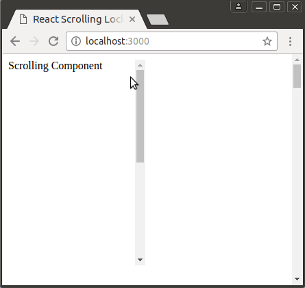

# React Scrolling Lock

[](https://travis-ci.org/viralganatra/react-clickoutside)
[](https://www.npmjs.com/package/react-scrolling-lock)

This is a higher order component for preventing page scrolling outside of a given component

It supports both class based components and stateless functional components.

## Demo



[https://viralganatra.github.io/demos/react-scrolling-lock/](https://viralganatra.github.io/demos/react-scrolling-lock/)

To build this example, clone this repo, navigate to the example directory and run:

````
yarn install
npm run start
````


## Installation

Using `yarn`

```
yarn add react-scrolling-lock
```

or `NPM`

````
npm install --save react-scrolling-lock
````

## How to use

### Basic functionality

````js
import React from 'react';

const Component = () => {
    const scrollingContainerStyles = {
        height: '300px',
        overflow: 'auto',
        width: '200px',
    };

    const scrollingComponentStyles = {
        height: '600px',
    };

    return (
        <div style={scrollingContainerStyles}>
            <div style={scrollingComponentStyles}>Scrolling Component</div>
        </div>
    );
};

export default Component;
````

````js
import React from 'react';
import ScrollingLock from 'react-scrolling-lock';
import ComponentToScrollLock from './component';

const Demo = () => {
    const ComposedComponent = ScrollingLock()(ComponentToScrollLock);

    return (
        <div style={{ height: '3000px' }}>
            <ComposedComponent />
        </div>
    );
};

export default Demo;
````

### Customising

This higher order function will add a wrapping `div` element to your component. By default it will add a style with `display: inline-block`. If you wish to use a class name you can pass an options object and use the className attribute:

````js
import React from 'react';
import ScrollingLock from 'react-scrolling-lock';
import ComponentToScrollLock from './component';

const Demo = () => {
    const ComposedComponent = ScrollingLock({
        className: 'my-class-name'
    })(ComponentToScrollLock);

    return (
        <div style={{ height: '3000px' }}>
            <ComposedComponent />
        </div>
    );
};

export default Demo;
````

## Compatibility

React v14 or greater is required.

## License

[MIT](LICENSE)